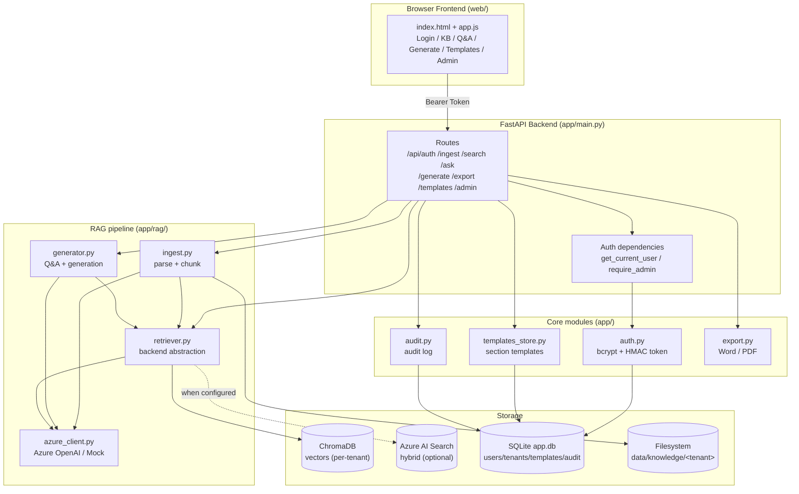
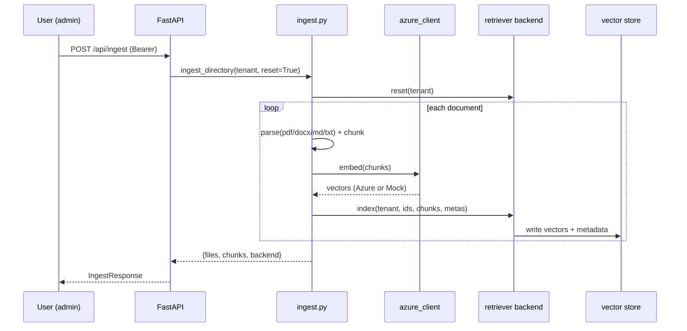
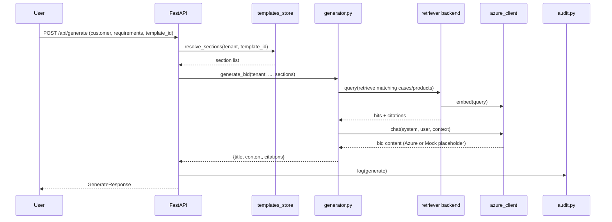
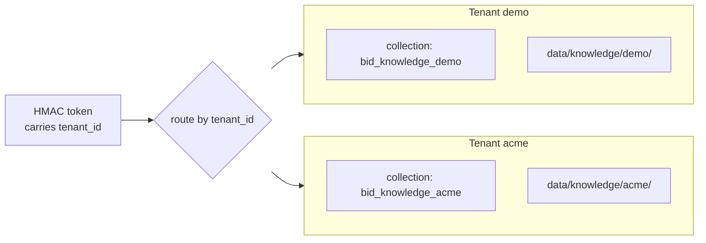

# Architecture

[中文](ARCHITECTURE.md) | **English**

This document describes the architecture, data flows, and key design decisions of the
Intelligent Bidding / Proposal Generation System.

## 1. Overall Architecture

## 2. Retrieval-Augmented Generation (RAG) Data Flow

### 2.1 Ingest

### 2.2 Generate

## 3. Multi-Tenant Isolation

- Each tenant has a **dedicated vector collection / index** and a **dedicated document directory**.
- The token carries `tenant_id`, which bounds all data access; users cannot read across tenants.

## 4. Pluggable Design

| Dimension | Default (zero-config) | When configured |
|-----------|----------------------|-----------------|
| LLM/Embedding | Mock (deterministic pseudo-vectors / placeholder text) | Azure OpenAI |
| Retrieval backend | ChromaDB (local persistence) | Azure AI Search (vector + keyword hybrid) |

Switching is decided automatically by `use_mock` / `use_azure_search` in `app/config.py`;
business code remains unchanged.

## 5. Module Responsibilities

| Module | Responsibility |
|--------|----------------|
| `app/config.py` | Env config; Mock/Azure detection; path management |
| `app/db.py` | Unified SQLite connection & schema init |
| `app/auth.py` | Users/tenants, bcrypt, HMAC tokens, FastAPI auth deps |
| `app/rag/azure_client.py` | Azure OpenAI wrapper + Mock fallback |
| `app/rag/store.py` | ChromaDB per-tenant isolation wrapper |
| `app/rag/retriever.py` | Retrieval backend abstraction (ChromaDB / Azure AI Search) |
| `app/rag/ingest.py` | Document parsing, chunking, indexing |
| `app/rag/generator.py` | Retrieval, Q&A, bid generation |
| `app/templates_store.py` | Section template CRUD |
| `app/audit.py` | Audit logging |
| `app/export.py` | Markdown → Word / PDF |

See the full API list in the [README](README.en.md#-api).
