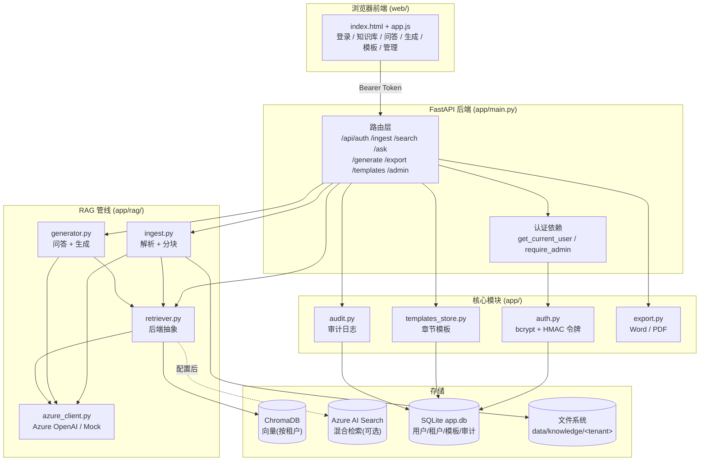
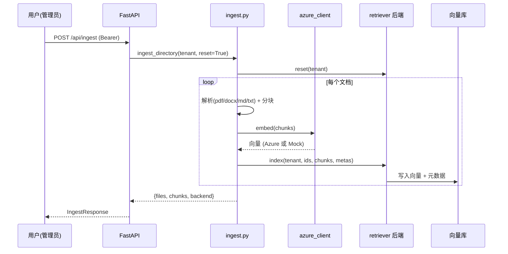
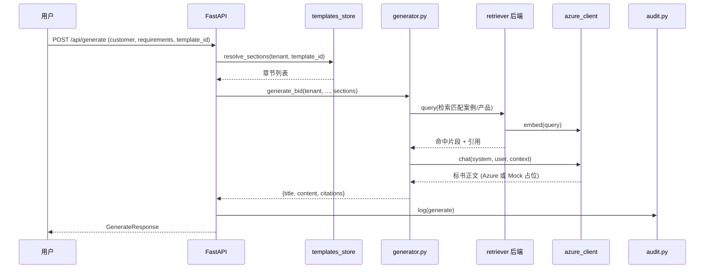
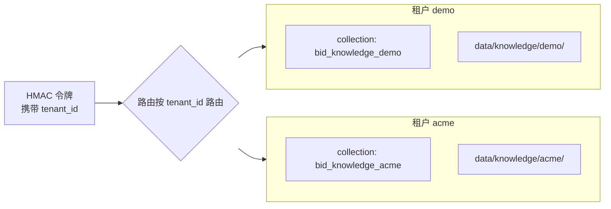

# 系统架构 (Architecture)

**中文** | [English](ARCHITECTURE.en.md)

本文档描述智能投标/方案生成系统的架构、数据流与关键设计。

## 1. 总体架构

## 2. 检索增强生成 (RAG) 数据流

### 2.1 知识入库 (Ingest)

### 2.2 标书生成 (Generate)

## 3. 多租户隔离

- 每个租户拥有**独立向量 collection / 索引**与**独立文档目录**。
- 令牌内含 `tenant_id`，所有数据访问以此为边界；用户无法跨租户读取。

## 4. 可插拔设计

| 维度 | 默认（零配置） | 配置后 |
|------|----------------|--------|
| LLM/Embedding | Mock（确定性伪向量/占位文本） | Azure OpenAI |
| 检索后端 | ChromaDB（本地持久化） | Azure AI Search（向量+关键词混合） |

切换由 `app/config.py` 的 `use_mock` / `use_azure_search` 自动判定，业务代码无需改动。

## 5. 关键模块职责

| 模块 | 职责 |
|------|------|
| `app/config.py` | 环境配置；Mock/Azure 判定；路径管理 |
| `app/db.py` | 统一 SQLite 连接与建表 |
| `app/auth.py` | 用户/租户、bcrypt、HMAC 令牌、FastAPI 鉴权依赖 |
| `app/rag/azure_client.py` | Azure OpenAI 封装 + Mock 降级 |
| `app/rag/store.py` | ChromaDB 按租户隔离封装 |
| `app/rag/retriever.py` | 检索后端抽象（ChromaDB / Azure AI Search） |
| `app/rag/ingest.py` | 文档解析、分块、入库 |
| `app/rag/generator.py` | 检索、问答、标书生成 |
| `app/templates_store.py` | 章节模板 CRUD |
| `app/settings_store.py` | 运行时 AI 模型配置（管理端切换） |
| `app/audit.py` | 操作审计日志 |
| `app/export.py` | Markdown → Word / PDF |

完整 API 列表见 [README](README.md#-api)。
