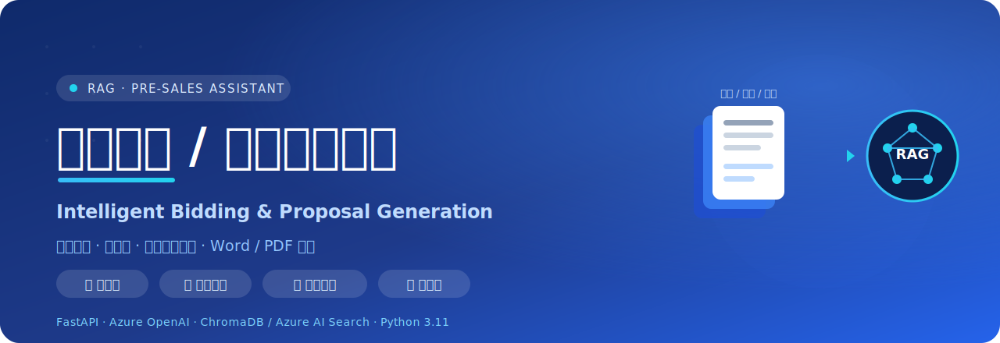

<p align="center">
  
</p>

# Intelligent Bidding / Proposal Generation System (RAG Pre-sales Assistant)

> A RAG-powered pre-sales knowledge assistant · FastAPI + Azure OpenAI + ChromaDB · Works out of the box (Mock mode included)


[中文](README.md) | **English**

An intelligent pre-sales assistant based on **RAG (Retrieval-Augmented Generation)**. It aggregates
your company's historical bids, success stories, and product documents to help sales / marketing /
technical teams quickly retrieve knowledge, get cited answers, and generate structured bid drafts —
dramatically shortening RFP response time and consolidating cross-team knowledge assets.

## ✨ Features
- 📚 **Knowledge ingestion**: parse PDF / Word / Markdown / TXT, Chinese-friendly chunking, vector indexing.
- 🔎 **Semantic / hybrid retrieval**: filter by document type (bid/case/product) and department; optional Azure AI Search hybrid retrieval.
- 💬 **Smart Q&A**: retrieval-augmented answers with source citations.
- 📝 **Bid generation**: input RFP requirements → retrieve matching cases/products → generate a multi-section bid draft with citations.
- 📐 **Custom section templates**: 3 built-in templates + per-tenant custom templates (CRUD), selectable at generation time.
- 📤 **One-click export**: export the generated bid to **Word (.docx)** or **PDF** (CJK font embedded).
- 🔐 **Login + multi-tenancy**: account system + per-tenant isolated knowledge bases (mutually invisible).
- 🧾 **Audit log**: records key actions (login / ingest / generate / export / admin) for admin review.
- 🤖 **Hot-swap AI models**: admins can configure Provider / Base URL / API Key, switch Azure OpenAI, DeepSeek, Qwen, Zhipu GLM, SiliconFlow, Moonshot/Kimi, or any OpenAI-compatible service, and freely toggle **Mock / real model** (auto / force-on / force-off), effective immediately.
- 🐳 **Containerized**: Dockerfile + docker-compose for one-command local startup.
- 🔌 **Azure OpenAI**: automatically falls back to **Mock mode** without credentials, so the full flow runs for demos.

## 🏗️ Tech Stack
Python 3.11 · FastAPI · Azure OpenAI (Chat + Embedding) · ChromaDB / Azure AI Search ·
bcrypt + HMAC tokens · python-docx + reportlab · vanilla web frontend

## 🚀 Quick Start

```bash
# 1. Create a virtual environment (Python 3.11)
python3.11 -m venv .venv
source .venv/bin/activate            # Windows: .\.venv\Scripts\Activate.ps1

# 2. Install dependencies
pip install -r requirements.txt

# 3. Configure (optional; Mock mode if left empty)
cp .env.example .env

# 4. Generate the sample knowledge base (multi-tenant: demo + acme)
python scripts/seed_data.py

# 5. Start the service
uvicorn app.main:app --reload --port 8000
```

Open http://localhost:8000 , log in with a demo account below, then click **Rebuild Knowledge Index**
on the "Knowledge" tab.

The sample knowledge base includes government, finance, manufacturing, and AI customer-service scenarios,
plus de-identified bidding templates rewritten from public industry patterns for a realistic AI generation demo.

> 💡 **Faster**: run `./run.ps1` (Windows) or `bash run.sh` (Linux/macOS) to auto-create the venv,
> install deps, seed data, and start the server.

### 🐳 With Docker
```bash
cp .env.example .env          # optional, empty = Mock mode
docker compose up --build
```
Visit http://localhost:8000 . Knowledge docs, vector index, and the user DB are persisted via volumes.

## 👤 Demo Accounts
| Username | Password | Tenant | Role |
|----------|----------|--------|------|
| admin | admin123 | demo | admin |
| presales | demo123 | demo | user |
| acme | acme123 | acme | admin |

> Tenant isolation: `demo` and `acme` have separate knowledge bases and vector indexes, mutually invisible.
> Admins can add tenants/users and view the audit log in the "Admin" tab; all users can manage templates in the "Templates" tab.

## 📂 Project Structure
```
app/
  config.py          Configuration (Azure / paths / auth)
  db.py              Shared SQLite connection & schema init
  auth.py            Users/tenants, bcrypt passwords, HMAC tokens
  templates_store.py Section templates (built-in + custom CRUD)
  audit.py           Audit logging
  export.py          Markdown -> Word / PDF (CJK safe)
  models.py          Pydantic models
  main.py            FastAPI routes
  rag/
    azure_client.py  Azure OpenAI wrapper (with Mock fallback)
    store.py         ChromaDB (per-tenant collection isolation)
    retriever.py     Backend abstraction: ChromaDB / Azure AI Search hybrid
    ingest.py        Parse + chunk + index
    generator.py     Q&A + bid generation
web/                 Frontend (index.html / app.js / styles.css)
data/
  knowledge/<tenant>/  Per-tenant knowledge documents
  chroma/              Vector persistence
  app.db               Users/tenants/templates/audit (SQLite)
scripts/
  seed_data.py       Multi-tenant sample data
  smoke_test.py      End-to-end test script
tests/               pytest unit tests
Dockerfile / docker-compose.yml   Containerization
run.ps1 / run.sh     One-command startup scripts
.github/workflows/ci.yml          GitHub Actions CI (runs unit tests + smoke test)
```

## 🔑 Configuration (.env)
| Variable | Description |
|----------|-------------|
| `AZURE_OPENAI_ENDPOINT` / `AZURE_OPENAI_API_KEY` | Empty = Mock mode |
| `AZURE_OPENAI_CHAT_DEPLOYMENT` | Chat model deployment name (e.g. gpt-4o) |
| `AZURE_OPENAI_EMBEDDING_DEPLOYMENT` | Embedding model deployment name (e.g. text-embedding-3-small) |
| `AZURE_SEARCH_ENDPOINT` / `AZURE_SEARCH_API_KEY` | Empty = ChromaDB; set to enable Azure AI Search hybrid retrieval |
| `EMBEDDING_DIM` | Vector dimension: Mock=256, real text-embedding-3-small=1536 (keep in sync) |
| `AUTH_SECRET` | Token signing secret (change in production) |
| `TOKEN_TTL_HOURS` | Token lifetime |
| `CHUNK_SIZE` / `CHUNK_OVERLAP` / `TOP_K` | Chunking & retrieval parameters |

## 📡 API
| Method | Path | Description | Auth |
|--------|------|-------------|------|
| POST | `/api/auth/login` | Log in and get a token | No |
| GET  | `/api/auth/me` | Current user | Bearer |
| POST | `/api/ingest` | Rebuild tenant index | Bearer |
| POST | `/api/upload` | Upload a document | Bearer |
| POST | `/api/search` | Semantic / hybrid retrieval | Bearer |
| POST | `/api/ask` | Smart Q&A | Bearer |
| POST | `/api/generate` | Generate a bid draft (supports `template_id`) | Bearer |
| GET  | `/api/templates` | List templates (built-in + custom) | Bearer |
| POST | `/api/templates` | Create a custom template | Bearer |
| DELETE | `/api/templates/{id}` | Delete a custom template | Bearer |
| POST | `/api/export/docx` | Export Word | Bearer |
| POST | `/api/export/pdf` | Export PDF | Bearer |
| GET  | `/api/stats` | Knowledge base stats | Bearer |
| GET  | `/api/admin/tenants` | List tenants | Admin |
| POST | `/api/admin/tenants` | Create a tenant | Admin |
| POST | `/api/admin/users` | Create a user | Admin |
| GET  | `/api/admin/audit` | Audit log (`scope=tenant\|all`) | Admin |
| GET  | `/api/admin/model-config` | View AI model config | Admin |
| PUT  | `/api/admin/model-config` | Switch Chat/Embedding model & temperature | Admin |

## 🔎 Switching to Azure AI Search Hybrid Retrieval
Set `AZURE_SEARCH_ENDPOINT` and `AZURE_SEARCH_API_KEY` in `.env` (and set `EMBEDDING_DIM` to the real
vector dimension). On restart the system automatically creates a dedicated index per tenant, uploads
vectors, and performs **vector + keyword** hybrid retrieval; the frontend status bar shows the active backend.

## 📌 Custom Document Metadata
Add a JSON front-matter at the top of a document to attach metadata:
```
---
{"title":"Some Bid","doc_type":"标书","department":"售前部","industry":"政务"}
---
Body content...
```

## 🧪 Testing
```bash
# Unit tests (no server required)
pytest -q

# End-to-end test (start the server first in another terminal)
python scripts/smoke_test.py
```

## 💡 Business Value
- **Efficiency**: bid drafts go from days to minutes, exportable to Word/PDF for delivery.
- **Trust**: all generated content is annotated with knowledge-base sources, fully traceable.
- **Collaboration + Isolation**: unified knowledge assets across teams, with secure multi-tenant isolation.

## 📚 Documentation
- [Architecture ARCHITECTURE.en.md](ARCHITECTURE.en.md) (with Mermaid architecture/sequence/multi-tenant diagrams)
- [Contributing CONTRIBUTING.en.md](CONTRIBUTING.en.md)
- [pre-commit Hooks Guide docs/pre-commit.en.md](docs/pre-commit.en.md)
- [GitHub Repo Setup docs/github-setup.en.md](docs/github-setup.en.md) (About / Topics)
- Chinese docs: [README.md](README.md) · [ARCHITECTURE.md](ARCHITECTURE.md) · [CONTRIBUTING.md](CONTRIBUTING.md)

## 📄 License
[MIT](LICENSE)
